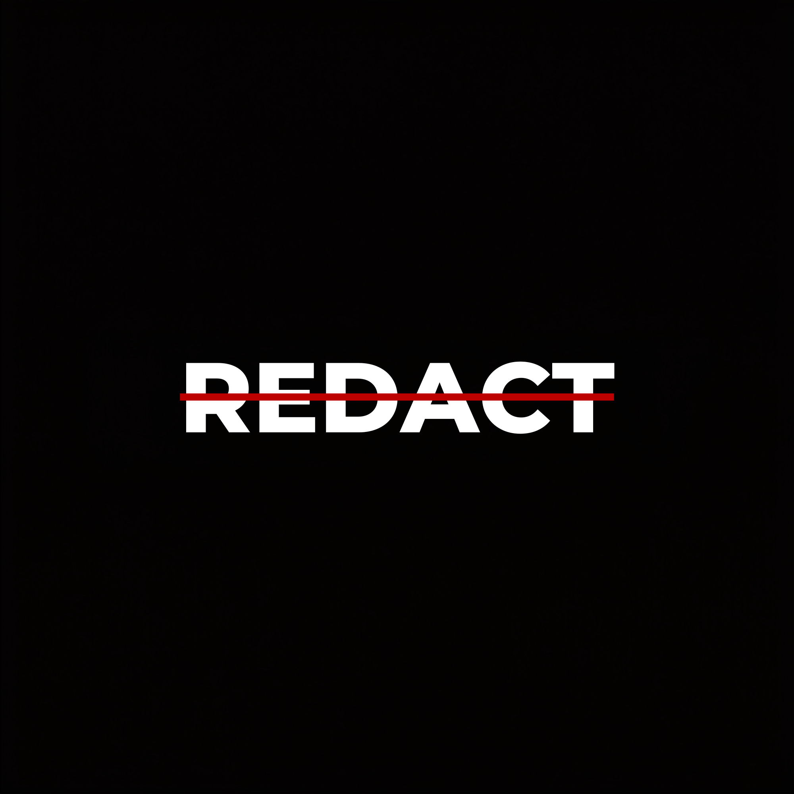
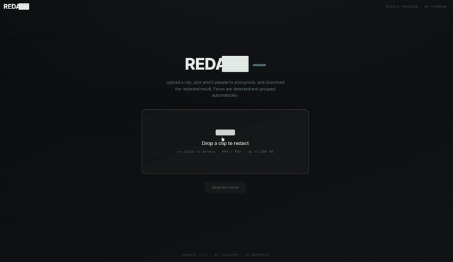
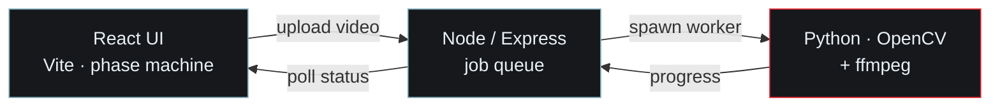
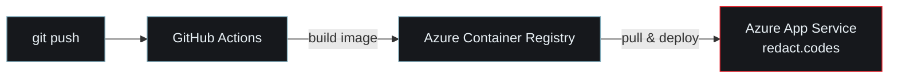

<div align="center">



### Selective face anonymization for video — blur *this* person, not *that* one.

[](https://redact.codes)
[](LICENSE)


<br/>



<br/>

*Upload a clip → Redact finds everyone in it → you pick who to blur → only they get redacted.*
*Nothing is stored. Every file is wiped when the session ends.*

</div>

---

## What makes it different

Most face-blur tools blur **every** face. Redact answers a harder question: **"blur this person, but not that one."**

In the demo above, three people are detected. Only the center subject is selected — and in the output, his face is blurred while the two people beside him stay perfectly visible. That selective control is the whole point.

| | |
|---|---|
| **Groups faces by identity** | The same person across 100 frames becomes one selectable subject — not 100 separate detections. |
| **You choose who to blur** | Tick who to anonymize; everyone you leave unticked stays visible. |
| **Protects the unknown** | A face the scan never catalogued is blurred by default, so nobody leaks by accident. |
| **Zero storage** | No accounts, no database. Uploads, faces, and outputs are wiped when the session ends. |

---

## How it works



**1 · Scan** — samples the video, detects faces with **YuNet**, and turns each into a 128-number "faceprint" with **SFace**. Faceprints are clustered into distinct people, a merge pass heals identities that split across pose changes, and brief phantom detections are dropped.

**2 · Select** — you see one card per person and pick who to redact.

**3 · Redact** — every frame is checked: *which catalogued person does this face resemble most?* If it's someone you selected → blur. If it matches nobody confidently → blur anyway (protect the unknown). Otherwise, leave it clear. Audio is restored and the video re-encoded to browser-playable H.264.

The whole thing is **asynchronous** — the API hands back a job ID instantly and the worker streams progress, so you watch a real progress bar instead of a frozen screen.

---

## Tech stack

| Layer | Tools |
|-------|-------|
| **Frontend** | React (Vite), Framer Motion |
| **Backend** | Node.js, Express, Multer |
| **CV worker** | Python, OpenCV (YuNet detection + SFace recognition), NumPy |
| **Video** | ffmpeg (H.264 re-encode, audio remux) |
| **Infra** | Docker, Azure App Service, Azure Container Registry, GitHub Actions (CI/CD) |

---

## Quick start

> You'll need **Node.js**, **Python 3**, and **ffmpeg** installed.

```bash
# 1 · clone
git clone https://github.com/RYzZzEN007/redact.git
cd redact

# 2 · Python worker
cd python && python3 -m venv venv && source venv/bin/activate
pip install -r requirements.txt && cd ..

# 3 · backend  (new terminal)
cd server && npm install && npm start        # → http://localhost:3001

# 4 · frontend (new terminal)
cd client && npm install && npm run dev       # → http://localhost:5173
```

Open `http://localhost:5173`, drop in a clip, and go. The YuNet and SFace models ship in the repo — no downloads needed.

<details>
<summary><b>Or run the whole thing in one Docker container</b></summary>

<br/>

Everything — React build, Node API, Python worker, ffmpeg — runs from a single image:

```bash
docker build -t redact .
docker run -p 3001:3001 redact     # → http://localhost:3001
```

This is the exact image that runs in production.
</details>

---

## Deployment

Redact runs live at **[redact.codes](https://redact.codes)** as a single Docker container on **Azure App Service**.



Every push to `main` triggers a **GitHub Actions** pipeline that builds the container, pushes it to **Azure Container Registry**, and deploys it — full CI/CD, no manual steps.

---

## Design decisions worth calling out

<details>
<summary><b>Why these choices — click to expand</b></summary>

<br/>

- **Merge threshold at SFace's own 0.363.** Clustering assignment is deliberately lenient (so one person doesn't split across poses), but *merging* compares two stable average faceprints — so it uses SFace's official same-person line. Getting this wrong once fused two different people into one identity; the fix was recognizing that a single noisy frame and a stable average deserve different thresholds.

- **Nearest-identity, not per-target matching.** Each face is classified against *everyone* catalogued and acts on the best match — so two look-alikes are told apart, and an unselected person stays clear even if they slightly resemble a selected one.

- **Blur when uncertain.** For a privacy tool, the safe failure is over-protection. A face that matches nobody confidently gets blurred rather than risk a leak.

- **A concurrency-1 job queue with a watchdog.** One blur job is minutes of pinned CPU, so jobs run one at a time; the API stays responsive and shows your place in line. A watchdog kills any job that stalls or overruns, so the queue can never deadlock.

- **H.264 output.** The raw OpenCV writer produces a codec browsers won't play; the final pass re-encodes to H.264 with `+faststart` so the result streams in-browser.

</details>

---

## Production considerations

<details>
<summary><b>Scaling & hardening notes — click to expand</b></summary>

<br/>

Redact runs as a **single instance** because the workload is CPU-bound serial processing, not high request volume — the right call for this scale. To scale it up you'd move the in-memory queue into Redis or a job queue like BullMQ, run multiple stateless worker instances consuming from it, and put a load balancer in front — but that's unnecessary complexity here.

For a busier public deployment, the main risk isn't a classic DDoS but **resource exhaustion**, since each job is minutes of compute. The mitigations: per-IP rate limiting, a bounded queue, per-session upload caps, and HTTPS behind a hardened proxy.

</details>

---

## Privacy

**No database. No accounts.** Uploads, thumbnails, faceprints, and outputs live only for the session and are wiped on "start over" and on server restart. Nothing about your video leaves the server it's processed on.

<div align="center">

<br/>

*Built by [Dhruv Choudhary](https://www.linkedin.com/in/dhruv-choudhary-43611017b/) · [github.com/RYzZzEN007](https://github.com/RYzZzEN007)*

</div>